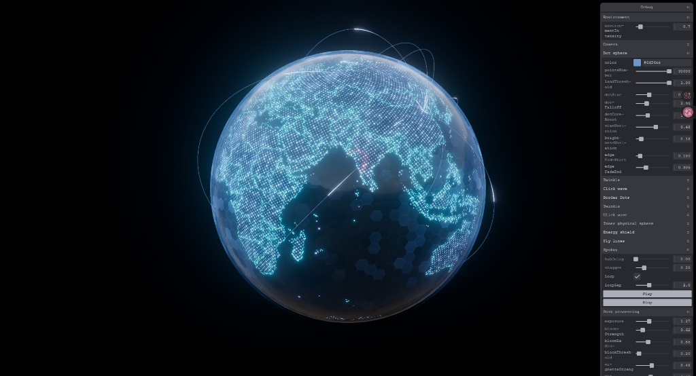

[English](README.en.md)

# 粒子地球 Flyline 可視化（Three.js WebGPU · TSL）

以 **WebGPU** 與 **Three.js Shading Language（TSL）** 實作的即時 3D 可視化——粒子陸地、六邊形底紋、能量光暈、多條 **Flyline** 弧線連接全球節點，並具 **Tweakpane** 即時調參與 **TSL 後製管線**（bloom、暈影）。目標是呈現資料大屏／科幻 FUI 風格，同時落在現代瀏覽器圖形管線上。



---

## 專案目標與定位

- 在 **單頁 Web** 上達成可展示、可反覆調整的 **高科技感地球場景**，適合作為大屏 Demo、技術分享或面試作品集演示。
- 以 **節點化著色（TSL）** 與 **WebGPU** 實作後製與渲染，對齊 Three.js 現行推進方向，而非僅沿用傳統 WebGL 管線。

---

## 實作亮點（履歷可摘錄）

| 方向 | 內容 |
|------|------|
| 即時渲染 | `WebGPURenderer` 非同步初始化、畫面與像素比適配 |
| 著色與後製 | `RenderPipeline` + `pass` / `BloomNode`；暈影以 TSL（`uv`、`smoothstep`、uniform）合成 |
| 場景複雜度 | 萬級粒子陸地、多層幾何與特效模組並存（內球、邊界、護盾、飛線等） |
| 資料與動效 | 樞紐／目標經緯度驅動飛線；可調延遲、錯開、循環與播放控制 |
| 工程化 | **Vite** 開發與打包；模組化 `Experience` / `World` / 各 `world/*.js`；**Tweakpane** 分組除錯的 `debuggerInit` 接線 |

---

## 畫面與互動（精要）

- **粒子陸地**：依貼圖閾值分佈粒子，可調數量、尺寸、衰減、明暗變化。
- **Flyline**：樞紐至多地節點的弧線動畫，支援時間編排與播放控制。
- **特效**：能量護盾、邊界點、點擊波、閃爍等可透過面板開關與調參。
- **互動**：點擊畫面觸發波紋與既有粒子／邊界聯動。

---

## 技術棧

| 項目 | 說明 |
|------|------|
| 渲染 | [Three.js](https://threejs.org/) **WebGPU**（`three/webgpu`） |
| 著色 / 後製 | **TSL**（`three/tsl`） |
| 構建 | [Vite](https://vitejs.dev/) 5 |
| 調參 UI | [Tweakpane](https://tweakpane.github.io/docs/) |
| 動畫 | [GSAP](https://gsap.com/) |

**環境**：需支援 **WebGPU** 的瀏覽器（建議新版 Chrome／Edge 等）。

---

## 本地執行

```bash
npm install
npm run dev
```

```bash
npm run build   # 輸出至 dist/
```

---

## 程式結構（精簡）

| 路徑 | 用途 |
|------|------|
| `src/app/Experience.js` | 場景生命週期、World／Renderer 組裝 |
| `src/renderer/Renderer.js` | `WebGPURenderer`、`RenderPipeline`、bloom + vignette |
| `src/world/world.js` | 聚合粒子球、飛線、護盾、內球、邊界點、點擊波等 |
| `src/world/*.js` | 各視覺模組與除錯欄位 |
| `src/utils/debug.js` | Tweakpane 與各模組接線 |
| `vite.config.js` | `root: src/`、`public/`、建置輸出 |

---

## 參考資料（TSL / WebGPU）

- [Three.js Shading Language（官方說明）](https://github.com/mrdoob/three.js/wiki/Three.js-Shading-Language)
- [TSL Q&A](https://github.com/boytchev/tsl-textures/wiki/Q&A)
- [Three.js WebGPU 範例](https://threejs.org/examples/?q=webgpu#webgpu_parallax_uv)
- [TSL 編輯器範例](https://threejs.org/examples/?q=webgpu#webgpu_tsl_editor)

---

## 授權

若公開倉庫並允許他人改作，建議於根目錄補上 `LICENSE`（例如 MIT）。
